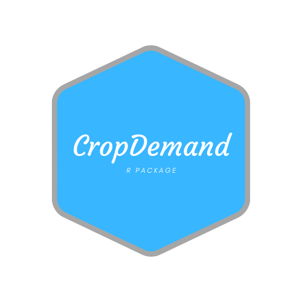

# cropDemand

<div class="fluid-row" id="header">
    


<!-- badges: start -->
<!-- badges: end -->

The goal of cropDemand is to make a crop water balance based on Thornwaite Matter (1955),  with possibility to change the available water capacity value according to different crops, for any region of Brazil. The cropDemand package uses the Terraclimate dataset (http://www.climatologylab.org/terraclimate.html) calibrated with the automatic weather stations of National Meteorological Institute of Brazil (INMET).


## Installation

To install the last version of cropDemand package follow this steps:

``` r
devtools::install_github("FilgueirasR/cropDemand")

```

## Example

This is a basic example which shows you how to run the cropDemand package:

``` r
## basic example code

#devtools::install_github("FilgueirasR/cropDemand")
library(cropDemand)
library(raster)

see_brazil_biomes()

img_eto <- loadROI(variable = "eto", region = "biomes_brazil" , sub_region = 5)
img_ppt <- loadROI(variable = "ppt", region = "biomes_brazil" , sub_region = 5)

start_date<-c('2000-01-01')
end_date<-c('2017-12-01')

monthly_ppt <- cropDemand::monthly_stack(stack = image_ppt, start_date = start_date, end_date = end_date)
monthly_eto <- cropDemand::monthly_stack(stack = image_eto, start_date = start_date, end_date = end_date)

cd<-waterDemand(out_dir = "C:/Users/betof/Desktop/teste_WD", ppt_stack = monthly_ppt , eto_stack = monthly_eto, AWC = 100)

cropDemand::plot_AWC(cd)


```
